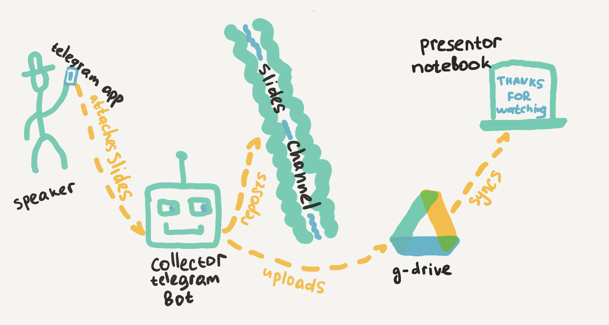
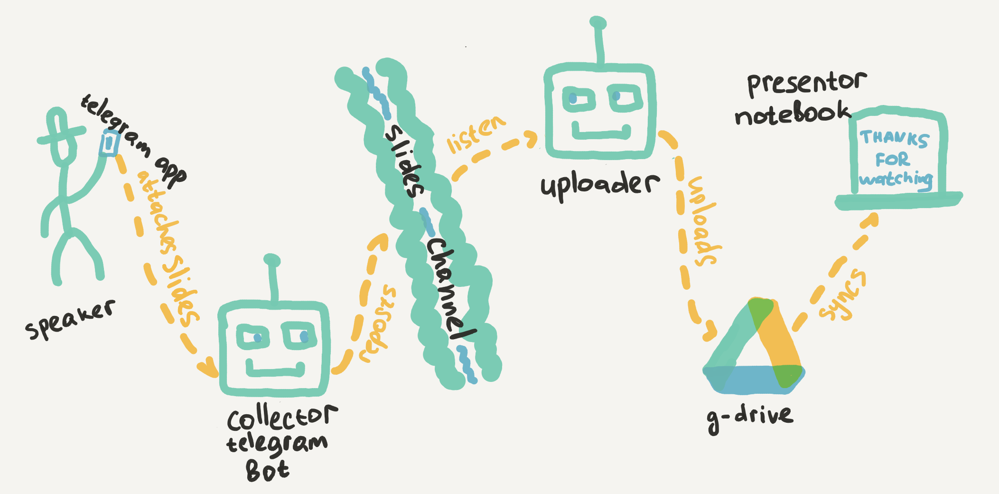

# tgslidesbot – Telegram Slides Bot
A JS serverless telegram bot receives slides from the speaker and uploads them to the Google Drive.


## How It Works

1. Speaker talks with the telegram bot and attaches the slides.
1. `tgslidesbot` reposts to the slides telegram channel and uploads them to the Google Drive.
1. Slides automatically appears on presenting computers.
1. Profit.

### More Technically

#### 1. Simple Mode



1. Telegram invokes serverless function on every update.
1. Function collects all information needed, reposts them to slides channel **and uploads slides to the Drive.**
1. Installed Google Drive desktop app automatically synchronizes cloud and local folders and files appears on the computer.

Limitations: according to the current [Telegram Bot API limitations](https://core.telegram.org/bots/api#getfile) bots  can't download files larger 20mb. To avoid this, use advanced mode.

#### 2. Advanced Mode



1. Telegram invokes serverless function on every update.
1. Function collects all information needed, reposts them to slides channel.
1. **Another function listens the channel, receives file using [external telegram api server](https://t-a-a-s.ru) and uploads it to the G-Drive.**
1. Installed Google Drive Desktop app automatically synchronizes cloud and local folders and files appears on the computer.


## Under the hood

* Serverless flows on JS
* State storage with DynamoDB
* [Serverless Framework](https://www.serverless.com/framework/docs/getting-started/)
* [Telegraf Bot Framework](https://telegraf.js.org/)

## How to install

### Get all credentials needed

* AWS or Yandex Cloud credentials [configured](https://serverless.com/framework/docs/providers/aws/guide/credentials/).
* A [Telegram](https://telegram.org/) bot `API Token`.
* Google Drive application with `google_private_key`.
* Google Drive folder with `drive_folder_id`
* TAAS account with `taas_api_key` (Optional, for advanced mode only)
* Telegram channel for slides with `slides_chat_id` (Optional)

## Installation

+ Install the Serverless Framework
```
npm install -g serverless
```

+ Install the required plugins
```
npm install
```

+ Create a [Telegram bot](https://core.telegram.org/bots#3-how-do-i-create-a-bot) using [@BotFather](https://telegram.me/BotFather).
+ Add the token received to `.env.yml` file
+ Deploy the application.
```
serverless deploy
```

+ Using `setWebhook` URL the configuration, register the webhook on Telegram
```
curl -X POST https://<api_endpoint_url>/prod/setWebhook
```

## Usage
Now you can `/start` a conversation with the bot.

## Removal
+ To delete the project from AWS.
```
serverless remove
```

## Local testing

Fill `.env` file with credentials, install Serverless and Docker. After run `dynamodb-local` and install dependencies:

```bash
docker run -p 8000:8000 --name dynamodb amazon/dynamodb-local -jar DynamoDBLocal.jar -sharedDb
npm install
```

Run DynamoDB migrations:
```bash
sls dynamodb migrate
```

After all, run command:

```bash
sls offline
```